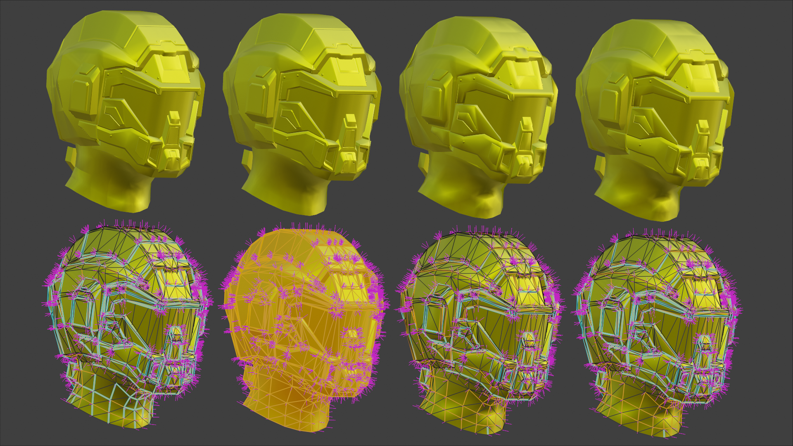

# blender_2_8_fbx_post_import_script
Attempt to understand what is missing in imported hard edges

Context 

fbx importing take in split meshes where hard edges should be; when applying "remove doubles" on these meshes the result is a lack of detail(softened edges). Normally people has "bug reported" remove doubles,.. this is unfair to remove doubles since the shading is acting as it should and so is remove doubles.

Steps the script should implement:

1: get the edge boundary loop of all mesh islands, store vertecii info, 

2: get the result of what remove doubles does right before creating faces. 

3: get borders of diferent mesh islands that would be joined by remove doubles 

4: store those edges relations, in "confronted pairs" maybe 

5: apply remove doubles 

6: for compared (degrees of face normals?)radians above a threshold mark the edge as hard
